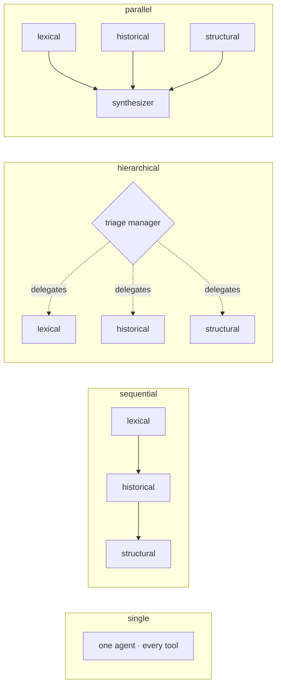

# Triangulate Agents

> When does a multi-agent architecture beat a single agent — and what does that gain cost?

Four CrewAI topologies — single-agent, sequential, hierarchical and parallel —
built from the same specialists and the same tools, then measured against each
other on **bug localization**: given a real GitHub issue and read-only access to
the repository as it stood when the bug was reported, name the files that have to
change. Ground truth is the files the real fix touched.

## Results

26 bugs, 12 Python projects, one run per topology, same instances and same budget
for all four.

| Topology | Accuracy@1 | Accuracy@5 | MRR | Seconds | Tokens | Cost |
|---|---|---|---|---|---|---|
| **single** | **0.88** | 0.92 | **0.90** | **23** | **52k** | **$0.28** |
| sequential | 0.81 | 0.92 | 0.87 | 61 | 118k | $0.65 |
| hierarchical | 0.85 | 0.92 | 0.88 | 64 | 128k | $0.72 |
| parallel | 0.81 | 0.92 | 0.87 | 29 | 115k | $0.66 |

**The single agent wins.** It is the most accurate, the cheapest and the fastest.
No multi-agent arrangement improves on it, and each costs 2.3–2.6× more.

The held-out split — 11 instances no prompt was ever tuned against — confirms the
ordering rather than contradicting it:

| Topology | Accuracy@1 | Accuracy@5 | MRR | Seconds | Cost |
|---|---|---|---|---|---|
| single | 1.00 | 1.00 | 1.00 | 17 | $0.09 |
| sequential | 0.91 | 1.00 | 0.95 | 31 | $0.16 |
| hierarchical | 1.00 | 1.00 | 1.00 | 38 | $0.19 |
| parallel | 0.91 | 1.00 | 0.95 | 20 | $0.21 |

Full tables, the hinted/unhinted breakdowns and the rank of every gold file per
instance are in [`reports/`](reports/).

### What the numbers actually say

**All four topologies find the same files; they differ only in ordering.**
Accuracy@5 is 0.92 across the board on `dev` and 1.00 on held-out. Of the 26 `dev`
instances the four topologies rank differently on four, and of the 11 held-out
instances on one — always by a single position.

**The task saturates.** Every held-out instance is solved by every topology
within five candidates. A single agent with lexical, historical and structural
tools is enough for single-file bug localization, which is why the elaborate
arrangements have no room to win — not because they reason worse.

**Two bugs defeat all four**, both in sympy: `sympy-20322` and `sympy-21612`. In
both, the vocabulary of the report points at one place and the fault lives in
another — the report describes LaTeX, the bug is in printing. This is a limit of
the three signals, not of how they are arranged, and no topology recovers it.

**The one thing multi-agent buys here is latency.** The parallel topology costs
what the sequential one costs and answers in half the time (29s vs 61s), because
its specialists work simultaneously. If wall-clock mattered more than money, that
is the trade available — and it is the only one.

### How to read them

- **These are not SWE-bench numbers.** SWE-bench reports `% resolved` — a patch is
  generated, applied, and judged by the repository's tests. This stops one step
  earlier, at localization. A higher figure here does not mean a better
  SWE-bench system.
- **A difference of one or two instances is not a difference.** One `dev` instance
  is worth ~4 points, one held-out instance ~9. The system is stochastic and the
  model does not accept a fixed temperature, so single-run figures carry sampling
  noise ([D-012](docs/DECISIONS.md)).
- **The headline is `dev`, not held-out**, because the held-out split saturates and
  cannot separate the topologies even in principle ([D-014](docs/DECISIONS.md)).
- **One instance is excluded** from every topology: the parallel arrangement cannot
  fit `matplotlib-26011` inside a 200k tokens/minute account limit
  ([D-013](docs/DECISIONS.md)).

## The topologies

Three signals locate a bug: the words of the report (**lexical** — search,
listing, reading), what changed recently (**historical** — log and blame), and
who imports whom (**structural** — the import graph). One specialist agent holds
the tools of one signal. The topologies differ only in how those specialists are
arranged.



| Topology | Arrangement | The question it answers |
|---|---|---|
| `single` | one agent holding every tool | is a single well-equipped agent enough? |
| `sequential` | each stage refines the previous one's candidates | does accumulated context beat independence? |
| `hierarchical` | a manager delegates only to the specialists it finds relevant | does routing save cost without losing accuracy? |
| `parallel` | all three from the raw report at once, then a synthesizer | does independence find what a chain funnels away? |

Every topology answers with at most 5 candidates, and every agent is capped at 15
tool-using iterations. The caps are identical across topologies, so no row can
buy accuracy with room the others were not given.

## What is measured

| | |
|---|---|
| Accuracy@1 / @3 / @5 | is the gold file among the first k candidates? |
| MRR | how highly was it ranked? `1/rank`, averaged over instances |
| tokens, cost, wall-clock | what the answer cost to produce |
| malformed candidates | answers naming a file without locating it — a format failure, not a reasoning one |

Precision, recall and F1 are not reported: every instance in SWE-bench Lite has
exactly one gold file, which makes precision degenerate — a correct answer inside
a five-candidate list would score 0.2.

Accuracy is always read next to cost, and always broken down by whether the
report already names the gold file (42% of instances do, usually in a pasted
stack trace). Those instances are markedly easier, and an aggregate hides it.

A hit requires the full repository-relative path: `formsets.py` does not count
when the answer is `django/forms/formsets.py`. Naming a file is not locating it.

Nothing from the analyzed repositories is ever executed. They are cloned, checked
out at the commit preceding the fix, and read. Every history tool is anchored at
`HEAD`, so the commit that fixes the bug — present in the clone — is unreachable.

## Requirements

| | Why |
|---|---|
| Python 3.12 | pinned in `.python-version` |
| [uv](https://docs.astral.sh/uv/) | dependency and environment management |
| git | the repositories are cloned and checked out through it |
| [ripgrep](https://github.com/BurntSushi/ripgrep) (`rg`) | backs the lexical search tool |
| ~2 GB of disk | the twelve cloned repositories |
| an OpenAI API key | only to run the agents; building the dataset needs none |

```bash
winget install BurntSushi.ripgrep.MSVC   # Windows
brew install ripgrep                     # macOS
apt install ripgrep                      # Debian / Ubuntu
```

On Windows, prefix debugging commands with `PYTHONIOENCODING=utf-8`: agent logs
contain characters the default console encoding cannot represent, and without it
the log is replaced by encoding errors.

## Quickstart

```bash
uv sync

# Build the golden set: 38 instances across 12 repositories, split dev / heldout
uv run python -m scripts.build_golden_set --dry-run   # inspect without writing
uv run python -m scripts.build_golden_set             # -> data/golden_set_v1.json

# Clone those repositories and verify every base commit and gold file
uv run python -m scripts.setup_repos --only flask     # one repository, to try it
uv run python -m scripts.setup_repos                  # -> data/repos/, ~2 GB
```

Both scripts are idempotent: rerunning them re-derives the same golden set and
skips repositories that are already cloned.

To run the agents, copy `.env.example` to `.env` and fill in the key:

```
OPENAI_API_KEY=sk-...
```

```python
from dotenv import load_dotenv; load_dotenv()

from flows import single
from tools.workspace import load_instances

result = single.run(load_instances()["django__django-15902"])
print(result.files, result.usage)
```

Every topology exposes the same `run(instance) -> LocalizationResult`: a ranked
list of files plus the reasoning, elapsed time and token usage.

Evaluating a topology over a whole split, then comparing them:

```bash
uv run python -m evals.runner --topology single --split dev --limit 5   # five instances, to try it
uv run python -m evals.runner --topology parallel --split dev --max-usd 1

uv run python -m evals.report --split dev   # -> reports/comparison_dev.md
```

Results go to `reports/runs/<topology>_<split>/`, one file per instance written
as it finishes, plus a `summary.json`. Each record keeps the ranked answer, its
reasoning and what every agent produced along the way — for the hierarchical
topology, which specialists the manager involved and what it asked them.
Rerunning resumes: instances already answered are not paid for twice. Delete the
directory to answer them again, which is required after any change to prompts or
budgets, or the summary would average answers produced under different
conditions.

The comparison is restricted to the instances every topology answered, and any
instance left out is listed rather than silently dropped.

```bash
uv run pytest   # the scoring rules, as cases with a known answer
```

## What did not work

**The multi-agent topologies, which is the result.** Three architectures, built on
the same specialists as the baseline's toolbox, none of them better than one
agent holding every tool. Reported as measured.

**The sequential chain can degrade a correct answer.** On `django-15902` the
lexical stage ranked the gold file first and the historical stage demoted it,
having found a recent commit that introduced the warning in the report. The
historical signal was right about the code and wrong about the fix location. This
is visible only because every stage's output is recorded.

**A chain's ceiling is its first stage.** Later stages can reorder candidates but
cannot introduce a file the lexical stage never surfaced.

**Bursty topologies are not always runnable.** The parallel arrangement spends the
same tokens as the sequential one but concentrates them, which makes it fail
against per-minute limits that the sequential one never notices. Total cost does
not predict this.

**Measurement bugs that produce credible numbers are the real hazard.** Three were
found and fixed during development, none of which raised an error: token counts
accumulating across instances because one model object was shared; a
`temperature=0` setting silently ignored for every agent holding tools; and
per-agent output recorded as empty because a tool name was matched in the wrong
form. Each produced plausible output while being wrong, which is why the scorers
have unit tests and why per-instance records are inspected rather than trusted.

## Known limitations

- **Single-file bugs only.** Every SWE-bench Lite instance has exactly one gold
  file, so multi-file localization — arguably where specialists should help most
  — is untested here.
- **Memorization.** SWE-bench Lite is public and predates the model, so some
  instances may be recalled rather than located.
- **One run per topology.** Sampling noise is carried, not averaged out.
- **Equal quotas per repository.** The golden set draws evenly from 12 projects
  rather than following the real distribution of bugs, so the numbers answer
  "how does this behave averaged across projects?", not "on a realistic mix?".

## Layout

```
scripts/   golden set construction and repository setup
tools/     read-only access to a checkout: files, search, history, imports
flows/     one module per topology, all exposing run(instance)
evals/     scorers, the runner, and the comparison report
data/      golden_set_v1.json (committed) and repos/ (regenerable, ignored)
reports/   per-instance results, summaries, and the comparison tables
tests/     unit tests for the scoring rules
docs/      decision log
```

## Documentation

- [`docs/DECISIONS.md`](docs/DECISIONS.md) — every decision that constrains how the
  numbers must be read, and what was considered instead.
- [`data/SCHEMA.md`](data/SCHEMA.md) — golden set schema and measured dataset
  properties.

## License

MIT — see [LICENSE](LICENSE).
